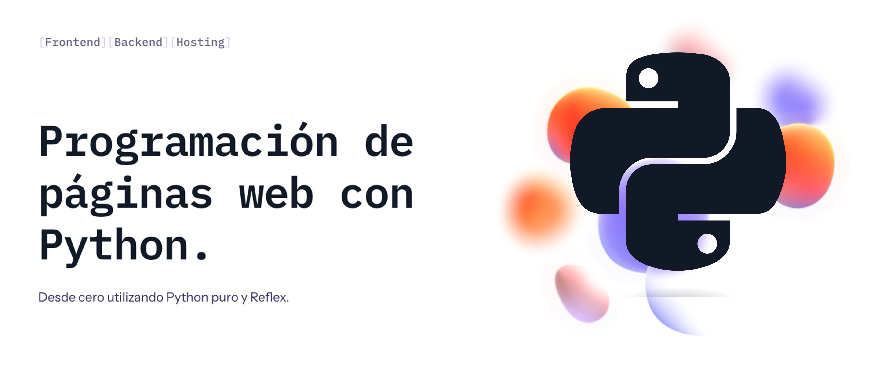

# Desarrollo Web con Python y Reflex

## Desarrollo web frontend con Python puro y Reflex desde cero

## Proyecto

Desarrollo web con Python puro utilizando el framework [Reflex](https://github.com/reflex-dev/reflex). Realizaremos un proyecto práctico que consistirá en desarrollar y publicar una nueva web.
Todo el código estará disponible para que cualquiera pueda usarlo.

### 💻 [Accede al código del proyecto](./link_bio)

##  Hola, mi nombre es Brais Moure.
### Freelance full-stack iOS & Android engineer

Soy ingeniero de software desde hace más de 12 años. Desde hace 4 años combino mi trabajo desarrollando Apps con creación de contenido formativo sobre programación y tecnología en diferentes redes sociales como **[@mouredev](https://moure.dev)**.

### En mi perfil de GitHub tienes más información

